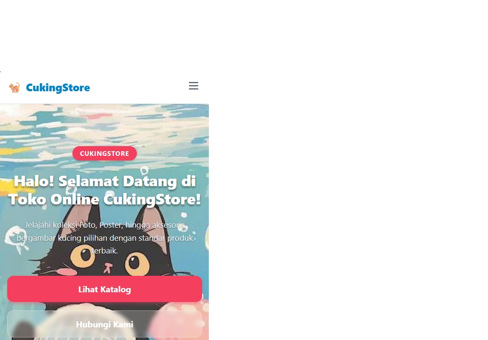
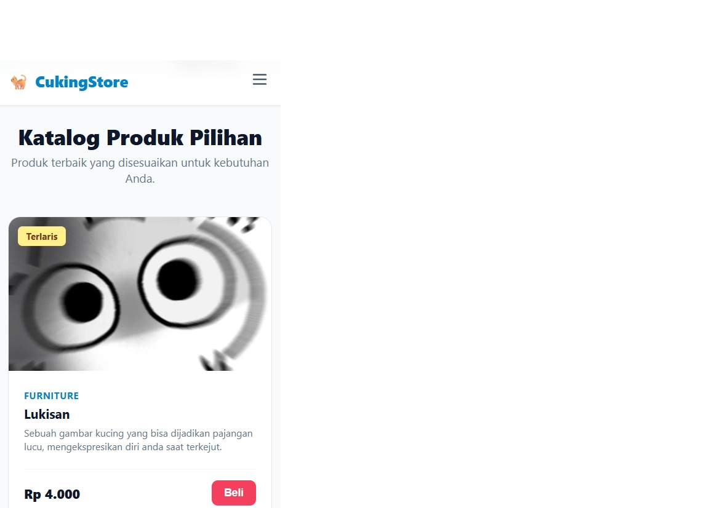
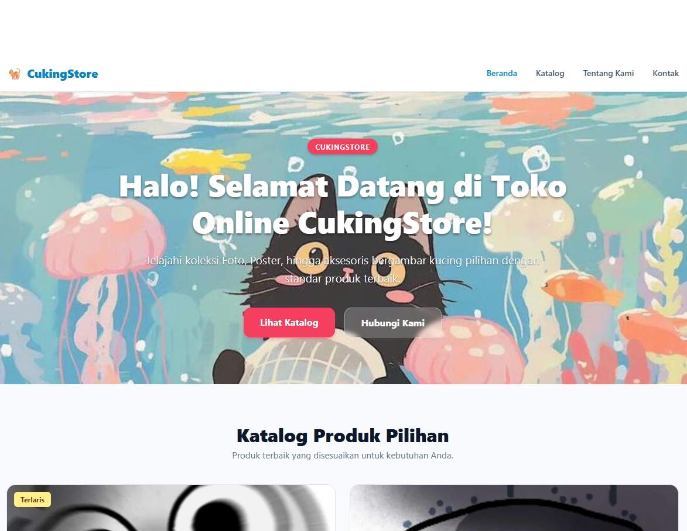
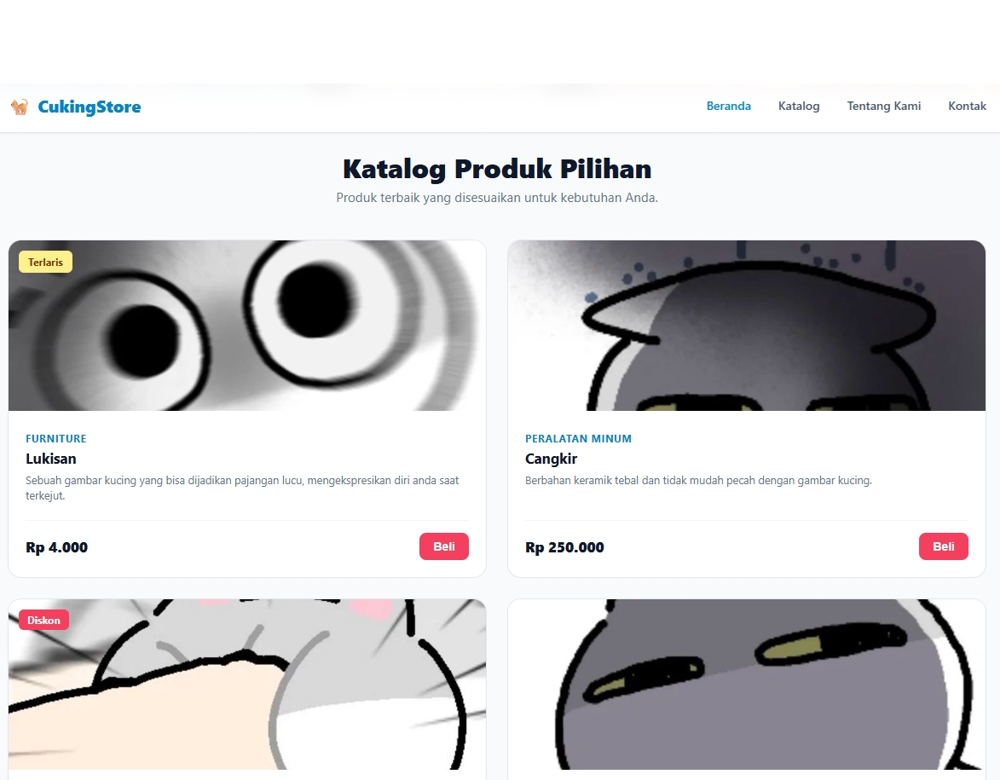
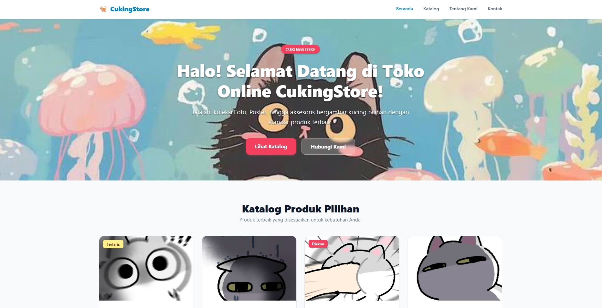
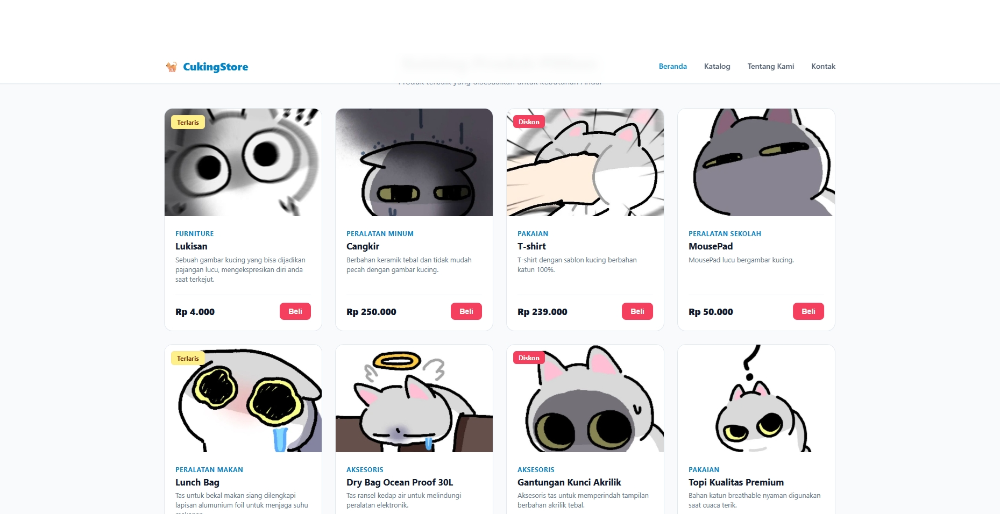

# Katalog Produk – CukingStore

Katalog CukingStore — website responsif untuk tugas kuliah Pemrograman Web.

## Identitas Pembuat

- Nama : Khalil Athallah
- NIM  : 4253250002
- Kelas: PSIK 25C

## Alamat Toko (Fiksi)

Universitas Negeri Medan, Deli Serdang, Jl. Pancing No. gatau.

## Dokumentasi Testing

Tampilan diuji pada 3 ukuran layar (Mobile, Tablet, Desktop). Setiap perangkat memiliki 2 tangkapan layar: bagian atas dan bawah halaman.

### Mobile (375px)

Atas:

Bawah:

### Tablet (768px)

Atas:

Bawah:

### Desktop (1280px)

Atas:

Bawah:

